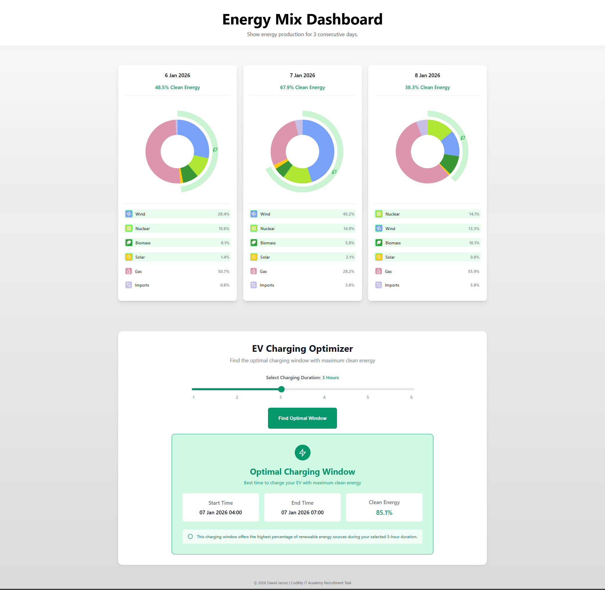

# Energy Mix Dashboard - Frontend

React application displaying energy production data and optimal EV charging window for next 2 days.

## Features

- **Energy Mix Visualization** - interactive donut chart showing average daily energy sources in UK, with visual distinction between clean and non-clean energy types
- **EV Charging Optimizer** - find the best charging window with maximum clean energy percentage in the next 2 days
- **Responsive Design** - horizontal scroll cards on mobile, grid layout on desktop

## Build With

- **React 18** with TypeScript
- **CSS3** - custom styling

## Setup

Prerequisites

- Node.js 16+
- Backend API running ([see backend repo](https://github.com/jaroosz/energy-mix-backend))

## Installation

1. Clone the repository:

```bash
git clone https://github.com/jaroosz/energy-mix-frontend.git
cd energy-mix-frontend
```

2. Install dependencies

```bash
npm install
```

3. Start development server

```bash
npm start
```

The app will open at `http://localhost:3000` and connect to the backend at `https://localhost:7250/api`

### Environment Variables

For production deployment, create `.env.local`:

```env
REACT_APP_API_URL=https://your-backend-url.com/api
```

## Screenshots

### Desktop View



### Mobile View


## Author

Dawid Jarosz
